

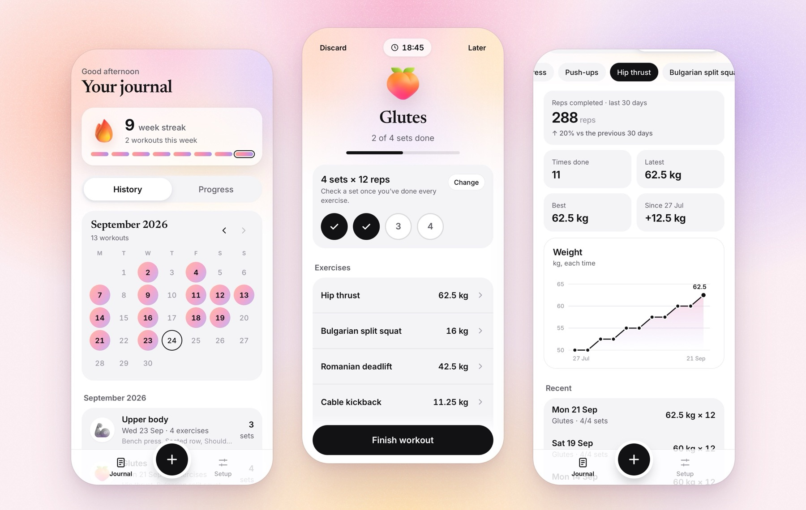

# Workout Journal

A calm, simple workout log for the gym. 
Plan your sessions once, check off your sets as you go, and watch every exercise get stronger.

**[Open Workout Journal →](https://workout.app.roberrini.com)**

---

## Plan your sessions once

Create a session for each kind of workout you do, like Glutes, Legs or Upper body. Give it a 3D icon and its sets and reps, then add the exercises it includes. Pick from a list of common exercises or type your own.

Each exercise is measured the way it's done: **weight** for lifts, **reps** for bodyweight moves like push-ups, **time** for a plank or the treadmill. Setting a value is optional. Leave it empty and it's filled in from your first workout.

Exercises are shared between sessions. The Squat in Legs and the Squat in Glutes are the same exercise, so its progress follows it everywhere.

  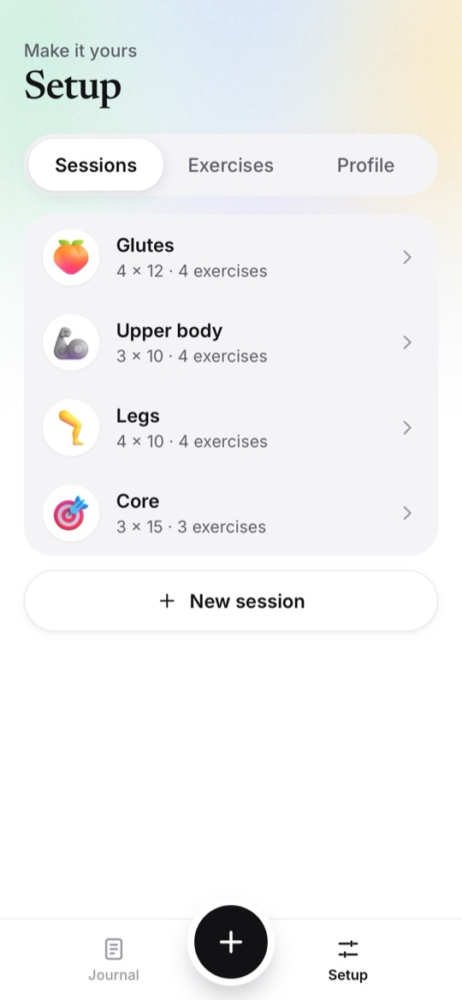
  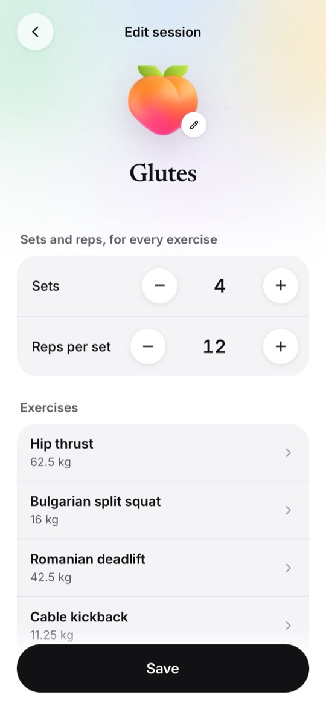
  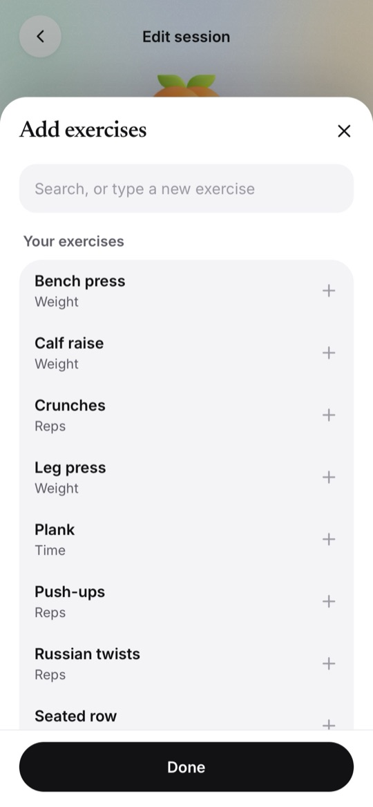

## Log your workout at the gym

Tap **+**, pick today's session, confirm sets × reps, and start. A set is one round through all the exercises: go through them, then tick the set.

- **Heavier today?** Tap an exercise to change its weight, reps or time for this workout.
- **Change of plan?** Add or remove an exercise, or change the number of sets on the fly.
- **Picks up from last time.** Each exercise starts at its planned value, or at last time's if you haven't set one. You can also choose to always start from last time.
- **Made for the gym floor.** Big tap targets, a timer, an option to keep the screen on, and it works without signal. Lock your phone and your workout is still there when you come back.

  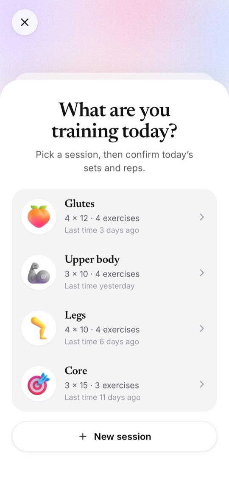
  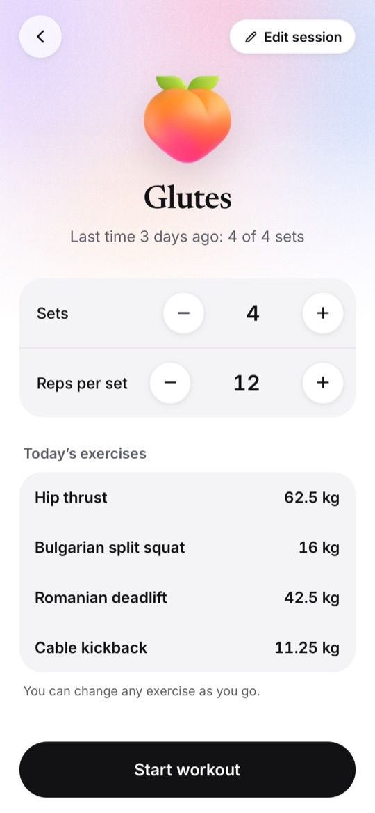
  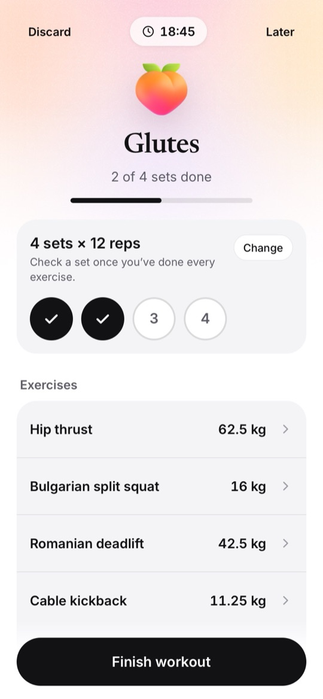
  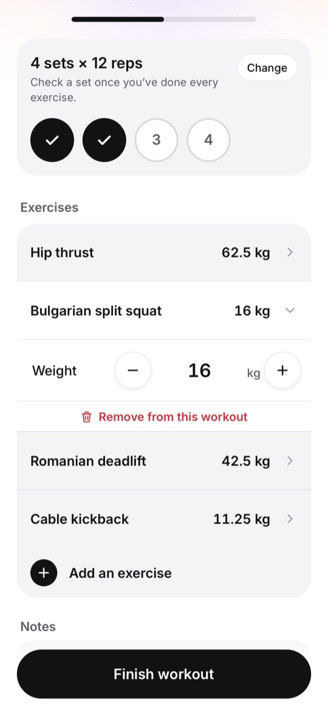

## Look back on your journal

Your weekly streak keeps you going: every week with at least one workout counts. The calendar shows each day you trained, and the history lists every workout with its sets and exercises. Tap one to read your notes, fix a detail, or delete it.

  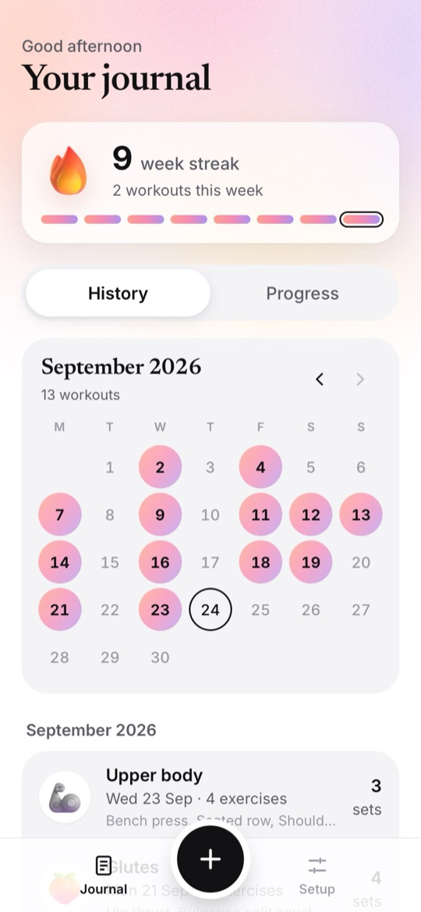
  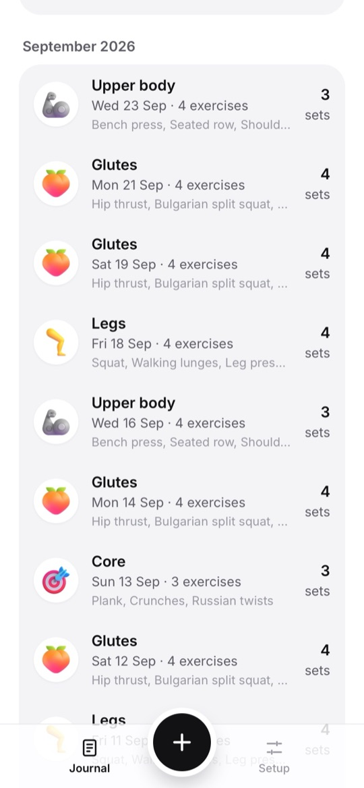
  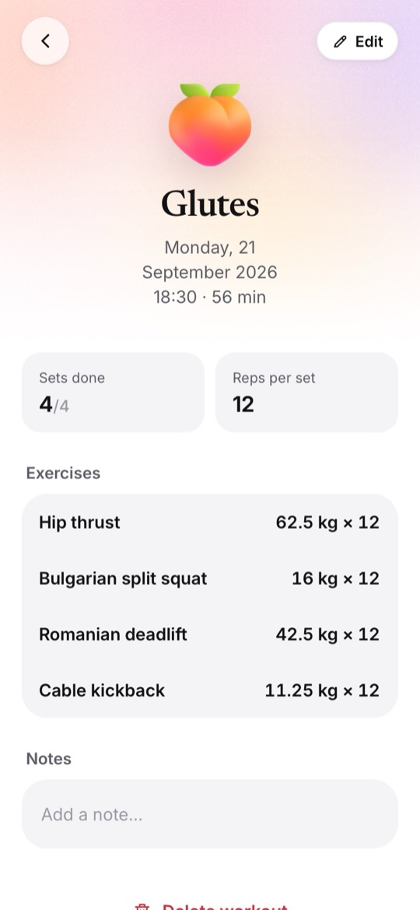

## See your progress

Pick an exercise to see how its weight has moved over time, your best, how far you've come since you started, and the reps you completed in the last 30 days compared with the 30 before. Exercises done without weights are followed by reps or time instead.

  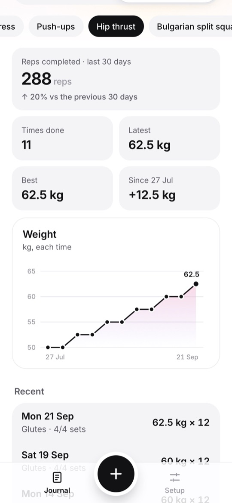
  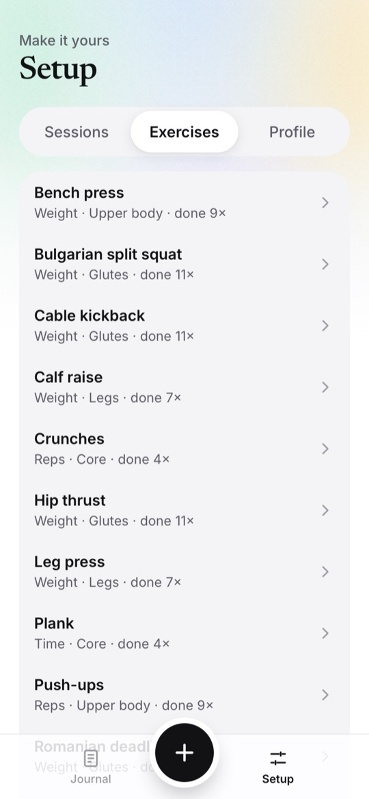

## Sign in, or don't

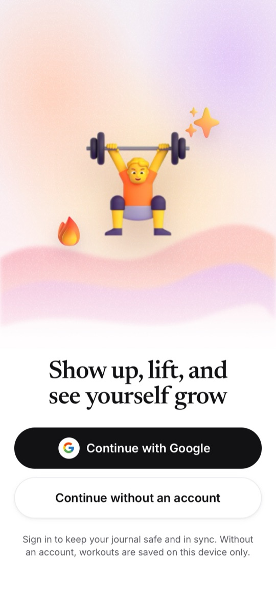

**Continue with Google** to keep your journal safe and in sync across your devices. Your data is private to your account.

Prefer not to sign in? Use the app **without an account** and everything stays on your device. If you sign in later, you can move those workouts into your account with one tap.

Make it yours in **Setup → Profile**: kg or lb, the day your week starts, how much + and − change a weight, where starting values come from, keeping the screen on during workouts, and a JSON export of all your data.

 

## Install it like an app

Workout Journal runs in your browser and installs on your phone's home screen:

- **Android (Chrome):** open the app, tap ⋮, then **Add to Home screen** or **Install app**.
- **iPhone (Safari):** tap **Share**, then **Add to Home Screen**.

It opens full screen, like any other app, and keeps working offline. An Android app for the Play Store is planned.

## Credits

- 3D icons: [Microsoft Fluent Emoji](https://github.com/microsoft/fluentui-emoji) (MIT)
- Fonts: [Newsreader](https://fonts.google.com/specimen/Newsreader) and [Inter](https://rsms.me/inter/) (SIL Open Font License)

## License

[MIT](LICENSE): use, change and share the code however you like. The 3D icons (MIT) and fonts (SIL Open Font License) keep their own licenses.

## For developers

Built with Vite, React and TypeScript, with Firebase for Google sign-in and storage, and deployed on Vercel. Setup, architecture, deployment and the Android plan are in **[docs/DEVELOPMENT.md](docs/DEVELOPMENT.md)**.
